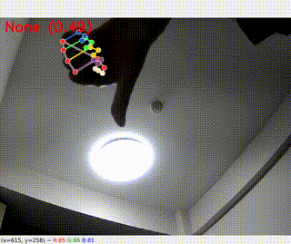

# Sample code for operating home appliances with hand gestures

Sample code to control home appliances using [hand gestures (Mediapipe)](https://developers.google.com/mediapipe/solutions/vision/gesture_recognizer) and [Nature Remo API (Python)](https://github.com/morinokami/nature-remo).

## Build environment

1. Fix the timezone in the Dockerfile to match yours.  
    [build/Dockerfile](build/Dockerfile)  
1. Create the docker image.  
    ```
    docker build --no-cache -t nature_remo ./build
    ```
1. Connect your USB camera.
1. Start Docker container.  
    ```
    xhost +
    docker run --name nature_remo --device /dev/video0:/dev/video0:mwr --volume="/tmp/.X11-unix:/tmp/.X11-unix:rw" --env="DISPLAY=$DISPLAY" -v [Absolute path of the cloned folder]:/home/workspace -it nature_remo /bin/bash
    ```
    Change the --device and the camera ID in the config file if necessary.


## Run sample code

1. Change the button name and the state in the code to match your environment.  
    If you don't know the button name and the state, run the sample code with the DEBUG flag set to True and check "Your appliances".
    * [src/main.py#L17](src/main.py#L17)
    * [src/main.py#L11](src/main.py#L11)
    * [src/modules/nature_remo/nature_remo.py#L50](src/modules/nature_remo/nature_remo.py#L50)  
1. Execute sample code.
    ```
    python3 src/main.py -c config/settings.yaml
    ```
    The code is designed to power on with Thumb_Up and power off with Thumb_Down.

## Result

